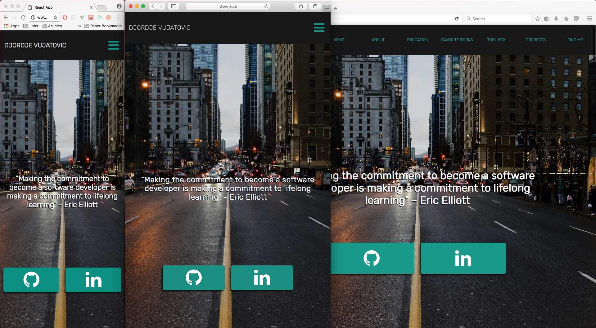
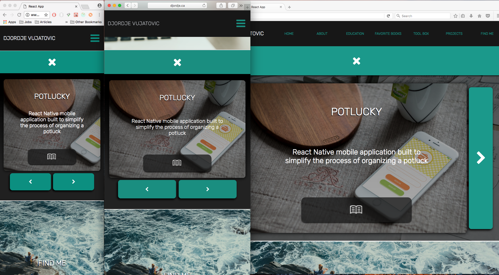

# Personal-Website

This website was built to be a portfolio piece for my resume. It is a showcase of my past projects, my skill set, and my education. It was completely designed and built by me, and is fully responsive, broswer compatible, and works to spec accorss numerous devices including phones, tablets, and desktops.

## Technologies Used
- Javascript (ES6)
- React
- Redux
- JSX
- SASS
- FireBase REST api
- React Router DOM
- Dev tools (Webpack, ESLint, Babel)
- Deployed as droplet on an ubuntu server using Digital Ocean

## Personal Learnings
The development of this project allowed me to build and design something from start to finish. It was an amazing experience as I would develop the design and functionality of this website on a day-to-day basis, simply by thinking about how I would like it to look and function, and jotting my ideas and UX / UI processes on a whiteboard.

The biggest challenge that I faced was the actual deployment of the website. It was my first time deploying a website with Digital Ocean, so there was a slight learning curve, but not one that I was not able to get past.

Aside from the actual day-to-day development/ design process of putting this website together, my favorite part (though at times the most frustrating) was ensuring that the website is cross-broweser and cross-device compatible. I thoroughly enjoyed getting down to the details, and making sure that everything looks to spec on all browsers and devices.
